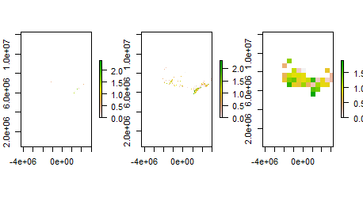

```{r setup, include=FALSE}
knitr::opts_chunk$set(echo = TRUE, fig.pos = "!H", out.extra = "")
```

# **Introduction**

This is a tutorial complementing the lecture on scales, available at <https://github.com/FedericoRiva>.
We will focus on two main parts: 1) effect of scale on occurrence data; 2) dependency in species rarity; and 3) spatiotemporal biodiversity trends.

```{r, echo=TRUE, message=FALSE}
# set up 
# packages needed in the tutorial
packages = c("raster", "sp", "maptools", "dplyr","vegan")

# load the packages; if missing, install & load 
package.check <- lapply(
  packages,
  FUN = function(x) {
    if (!require(x, character.only = TRUE)) {
      install.packages(x, dependencies = TRUE)
      library(x, character.only = TRUE)
    }
  }
)

# # open and clean data
# library(data.table)
# 
# # to handle raster and vector spatial data
# library(raster)
# library(sp)
# 
# # to get the world map when plotting original data
# library(maptools)
# 
# # data wrangling
# library(dplyr)
# 
# # analysis of diversity
# library(vegan)
```

We will first load a table that contains occurrence data for one species (*Pieris rapae)* in Canada in 2013.

```{r, echo=FALSE, message=FALSE}
 # downloading data from GBIF https://www.gbif.org/
query_gbif <- data.table::fread("Data\\query_gbif_2013.csv", header = TRUE)

```

Always look at your data, particularly when dealing with spatial data.
Let's check if the cabbage white (*Pieris rapae*), a generalist species common in Europe, NA and Oceania, occurs only in CA

```{r}
example <- query_gbif[query_gbif$species == "Pieris rapae"]
data(wrld_simpl)
plot(wrld_simpl, 
     #xlim=c(min(example$decimalLongitude)-1, max(example$decimalLatitude)+1),  
     # you can adjust the extent of your map
     #ylim=c(min(example$decimalLongitude)-1, max(example$decimalLatitude)+1), 
     axes=TRUE, col="grey")
points(example$decimalLongitude, example$decimalLatitude, col="blue", pch=20, cex=1.7)

```

All good - Data restricted to Canada, no clear outliers and/or occurrences in the ocean, etc.
Note that this plot is based on geographic coordinates, expressed in degrees.

# Part 1: Effect of scale on occurrence data

To evaluate issues of spatial scales, one needs to account for the area of different raster cells, which require protected coordinates, expressed in metric system.

## Project the data downloaded from GBIF

Here, we are telling R that we want to project spatial data in a specific coordinate system (crs).
Then, we are transforming the table we have in spatial points that we will plot to a map of Canada.

```{r}
#telling R what coordinate system we want
crs <- crs("+proj=lcc +lat_0=0 +lon_0=-95 +lat_1=49 +lat_2=77 +x_0=0 +y_0=0
+datum=WGS84 +units=m +no_defs ")
# project geographic coordinates (from degrees to metric units)
coordinates(query_gbif) <- c("decimalLongitude", "decimalLatitude")
proj4string(query_gbif) <- CRS("+init=epsg:4326")
# GBIF geographic coordinates
#"+init=epsg:4326 +proj=longlat +ellps=WGS84 +datum=WGS84 +no_defs +towgs84=0,0,0"

query_gbif <- sp::spTransform(query_gbif, crs)
# project according to adaptwest raster data
query_gbif <- as.data.frame(query_gbif)

# replace name of columns after projection
names(query_gbif)[names(query_gbif) == 'decimalLongitude'] <- 'x'
# changed from degrees to metric
names(query_gbif)[names(query_gbif) == 'decimalLatitude'] <- 'y'
# changed from degrees to metric

# prepare coordinates and data for spatial dataframe
coordinates_query_gbif <- query_gbif[ , c("x", "y")]  
# coordinates; equivalent to query_gbif[, 49:50]
data_query_gbif   <- query_gbif[ , c(9:10, 31)] 
# data you want to keep

# make a SpatialPointsDataFrame object
spdf <- sp::SpatialPointsDataFrame(coords       = coordinates_query_gbif,
                                    data        = data_query_gbif, 
                                    proj4string = crs)


```

Now the coordinates in degrees from GBIF are expressed in meters from the origin of the projected reference system.

Now we are plotting a raster of climate velocity change for Canada.
Climate velocity here is accounted for using the euclidean distance (i.e., shortest straight line) between two cells with analog climates.
The dataset is available at <https://adaptwest.databasin.org/pages/adaptwest-velocitymed/>.
Then, we are adding the occurrence points of *Pieris rapae*.

```{r}
VEL_ED <- raster::raster("Data\\velocity\\velocity.ED.tif")

plot(VEL_ED)
plot(spdf,
     #col = spdf$year,
     add = TRUE)

```

Note that some points seem to be in the ocean.
This is a very annoying visual glitch in R, but it does not affect point extraction; see <https://stackoverflow.com/questions/28371270/resizing-plot-output-causes-raster-and-points-to-become-misaligned> for a solution.
But don't worry about it now.

## Accounting for scales in occurrence data

Now that the occurrence data is projected, we can look at its distribution across Canada with more attention.
To do this, we transformed points into a raster, counting the number of occurrences in each 5 km cell.
Then, we aggregated our spatial units to evaluate the degree to which community science efforts covered Canada.
You can see how it was done in detail in the Supplementary Materials.This is the final plot:
{width="100%"}

**Question 1:** Based on this example and previous topics discussed in class, how does scale affect the way we perceive occurrence data?

# Part 2: Rarity and its relationship to spatial grain

In the second part of the tutorial, we will look at how spatial scales affect the relative rarity of species in a community.
We will contrast patterns of rarity in Canada vs. patterns of rarity in three Provinces (Alberta, Ontario and Quebec) based on our entire dataset.
Then, we will resample an equal number of occurrences from the four locations, and assess whether effects are due to are or to sampling.

```{r}

# inspecting the species occurrence distribution
SOD <- as.data.frame(table(query_gbif$species))
head(SOD)
# as expected the cabbage white (Pieris rapae) is the most common species in these samples
#(check your backyard if you have never seen one); monarch butterflies (Danaus plexippus)
#also count for 12.000 observations. 
```

Let's plot an histogram showing the frequency of occurrences in log.

```{r}
hist(log10(SOD$Freq))

# most species have been observed between 10 and 1000 occurrence data
```

**Question 2 :** Plot another histogram using unlogged occurrence data and compare the two histograms.
How does the visualization of the data change?

Now, we will see which provinces we have in the dataframe and we will select occurrences from Alberta, Quebec and Ontario.

```{r}
# inspecting the species occurrence distribution at lower spatial levels (Provinces)
levels(as.factor(query_gbif$stateProvince))

# provinces
query_gbif_subset_SOD_AB <- query_gbif[which(query_gbif$stateProvince == "Alberta"), ]
query_gbif_subset_SOD_QC <- query_gbif[which(query_gbif$stateProvince == "Quebec"), ]
query_gbif_subset_SOD_ON <- query_gbif[which(query_gbif$stateProvince == "Ontario"), ]

SOD_AB <- as.data.frame(table(query_gbif_subset_SOD_AB$species))
SOD_QC <- as.data.frame(table(query_gbif_subset_SOD_QC$species))
SOD_ON <- as.data.frame(table(query_gbif_subset_SOD_ON$species))

```

Here, we divide by the total number of individuals in each dataset, so as to transform counts into proportions:

```{r}
SOD$Freq <- SOD$Freq/sum(SOD$Freq) 
SOD_AB$Freq <- SOD_AB$Freq/sum(SOD_AB$Freq) 
SOD_QC$Freq <- SOD_QC$Freq/sum(SOD_QC$Freq) 
SOD_ON$Freq <- SOD_ON$Freq/sum(SOD_ON$Freq) 
```

And finally plot the curves for AB, QC, ON and Canada.

```{r}
plot(SOD$Freq[order(SOD$Freq)], xaxt='n', frame.plot=TRUE, 
     main="Species-occurrence ranking plot",
     ylab="Frequency of occurrence", xlab="Species ranked by frequency of occurrence",
     pch = 16,
     ylim = c(0, 0.10))

par(new=TRUE)
plot(SOD_AB$Freq[order(SOD_AB$Freq)], col = "red", axes=FALSE, frame.plot=TRUE,
     ylab="", xlab="", pch = 16,
     ylim = c(0, 0.10))

par(new=TRUE)
plot(SOD_QC$Freq[order(SOD_QC$Freq)], col = "blue", axes=FALSE, frame.plot=TRUE, 
     ylab="", xlab="", pch = 16,
     ylim = c(0, 0.10))

par(new=TRUE)
plot(SOD_ON$Freq[order(SOD_ON$Freq)], col = "gold", axes=FALSE, frame.plot=TRUE, 
     ylab="", xlab="", pch = 16,
     ylim = c(0, 0.10))

legend(1, 0.09, # position of the legend; the x axis goes from 0 to 0.1
       #(10% 0f the occurrences observed for a given species)
       legend=c("CA", "AB", "QC", "ON"),
       col=c("black", "red", "blue", "gold"), lty=1, cex=1)


```

These are typical SODs, where many species are rare and a handful tend to dominate the community.
Note that Canada seems to have less evenness than the other smaller spatial units.
Why would that be?

```{r}

# how many observations in different datasets?
nrow(query_gbif)
nrow(query_gbif_subset_SOD_AB)
nrow(query_gbif_subset_SOD_QC)
nrow(query_gbif_subset_SOD_ON)
```

It seems that we have very different numbers of observation in each spatial unit.
To address this, we can look at the same number of observations for each of the spatial units.

```{r}
# let's simulate 1700 individuals, the limiting factor being the spatial unit with the
#lowest number of individuals.

SOD <- query_gbif[sample(nrow(query_gbif), 1700), ]
query_gbif_subset_SOD_AB <- query_gbif_subset_SOD_AB[sample(nrow(query_gbif_subset_SOD_AB), 1700), ]
query_gbif_subset_SOD_QC <- query_gbif_subset_SOD_QC[sample(nrow(query_gbif_subset_SOD_QC), 1700), ]
query_gbif_subset_SOD_ON <- query_gbif_subset_SOD_ON[sample(nrow(query_gbif_subset_SOD_ON), 1700), ]

SOD <- as.data.frame(table(query_gbif$species))
SOD_AB <- as.data.frame(table(query_gbif_subset_SOD_AB$species))
SOD_QC <- as.data.frame(table(query_gbif_subset_SOD_QC$species))
SOD_ON <- as.data.frame(table(query_gbif_subset_SOD_ON$species))

##
SOD$Freq <- SOD$Freq/sum(SOD$Freq) # repeat for all other SODs
SOD_AB$Freq <- SOD_AB$Freq/sum(SOD_AB$Freq) # repeat for all other SODs
SOD_QC$Freq <- SOD_QC$Freq/sum(SOD_QC$Freq) # repeat for all other SODs
SOD_ON$Freq <- SOD_ON$Freq/sum(SOD_ON$Freq) # repeat for all other SODs
```

And now we are plotting the same graph but using the subset of data in each spatial unit.

```{r}
#par(mfrow=c(1,5))
plot(SOD$Freq[order(SOD$Freq)], xaxt='n', frame.plot=TRUE, 
     main="Species-occurrence ranking plot",
     ylab="Frequency of occurrence", xlab="Species ranked by frequency of occurrence",
     pch = 16,
     ylim = c(0, 0.10))

par(new=TRUE)
plot(SOD_AB$Freq[order(SOD_AB$Freq)], col = "red", axes=FALSE, frame.plot=TRUE,
     ylab="", xlab="", pch = 16,
     ylim = c(0, 0.10))

par(new=TRUE)
plot(SOD_QC$Freq[order(SOD_QC$Freq)], col = "blue", axes=FALSE, frame.plot=TRUE, 
     ylab="", xlab="", pch = 16,
     ylim = c(0, 0.10))

par(new=TRUE)
plot(SOD_ON$Freq[order(SOD_ON$Freq)], col = "gold", axes=FALSE, frame.plot=TRUE, 
     ylab="", xlab="", pch = 16,
     ylim = c(0, 0.10))

legend(1, 0.09, # position of the legend; the x axis goes from 0 to 0.1
       #(10% 0f the occurrences observed for a given species)
       legend=c("CA", "AB", "QC", "ON"),
       col=c("black", "red", "blue", "gold"), lty=1, cex=1)

```

**Question 3:** Looking at the species-occurrence ranking plots of Canada, Ontario, Quebec and Alberta, what pattern can you infer? What could explain this pattern? How does sample bias correction help us deal with uncertainty in this case? You can take a look at the required reading for lecture 4, Loreau 2010 (What is biodiversity?).

# Part 3: Spatiotemporal trends in biodiversity

I prepared a table where the 262 butterfly species of Canada are recorded in \~ 30.000 checklists between 2010 and 2021.
For each checklist, I also provided spatial and temporal information (columns 262-280).
For this part of the tutorial, I retained only 5000 checklists randomly selected from the original eButterfly dataset (table.csv file) and filtered only species with 100+ observations since 2010.

With the following code you can: 1. Select one species and one temporal scale; 2. Calculate the proportion of checklists that found their species in every temporal scale; 3. Perform a linear model lm() to see how temporal scales might affect temporal trends observed

Now, we will load the data and select one species.

```{r}
table <- read.csv("Data/table.csv")

# select only species
table_spp <- table[,2:262]

```

Then, we sum of all occurrences for a species and select species that were seen at least 100 times

```{r}
frequency_species <- colSums(table_spp)

# retain only species seen at least 100 times
frequency_species <- frequency_species[frequency_species > 100]

# keep their name
filter <- names(frequency_species)

# filter table species
table_spp <- table_spp[, (colnames(table_spp) %in% filter)]
```

Now we select Atlantis Fritillary (*Speyeria atlantis*), which is a northern species from the Maritimes

```{r}
species <- as.data.frame(table_spp$Speyeria.atlantis) 

```

Next, we add a temporal scale: we divide each presence or absence record into one-year period, two-year period, three-year periods (i.e. if a species was seen in 2012, it will also be in 2010-2012 and 2010-2013 time periods)

```{r}

# split the 5000 rows into subsets representing the temporal scale, e.g., 12 one-year periods

species$year <- table$year
species$year2 <- table$year2
species$year3 <- table$year3

####
#### FIRST TEMPORAL SCALE (1 year)
####
year_data <- split(species, species$year)


frequency_list <- list()
for(i in 1:length(year_data)){ # for every element of the list (12 year typically)
frequency_list[[i]] <- mean(year_data[[i]][,1])
# calculate the mean number of time the species was observed that year   
}

frequency_list <- do.call(rbind.data.frame, frequency_list)
colnames(frequency_list)[1] <- "frequency"


```

Here, we add the temporal scale (in this case, 1 year intervals) to the frequency dataset

```{r}
frequency_list$temporal_scale <- levels(as.factor(species$year))
#change year accordingly to your temporal scale (year2, year3)

frequency_list$time_cov <- seq(1, nrow(frequency_list), 1)
# this is just a number that represent time (1 is first year of observations and so on). 

```

Now let's look at a barplot showing the frequency of observations of this species across the years

```{r}
barplot(frequency_list$frequency ~ frequency_list$temporal_scale)

```

In a scatterplot you can see the variation in frequency of observations and you can also draw a line showing a tendency using a linear model. A linear regression model describes the relationship between a dependent variable, y, and one or more independent variables, X.
In our case, it shows if the frequency of observations of the species is related (or not) to time

```{r, echo=TRUE}
plot(frequency_list$frequency ~ frequency_list$time_cov)

model <- lm(frequency_list$frequency ~ frequency_list$time_cov)

abline(model)

```

If we look at the summary of the model, we can see that for Speyeria atlantis, looking at the 1 year intervals, there is a significant decrease of observations through time.
That is because the negative Estimate -0.00444 is significant (p-value of 0.029990 is lower than threshold 0.05).

```{r, echo=TRUE}
summary(model)

```

Now, re-run the same code from above, but change the temporal scale, for example, for three-year time periods.

```{r}

year3_data <- split(species, species$year3)


frequency_list <- list()
for(i in 1:length(year3_data)){
  # for every element of the list (12 year typically)
  frequency_list[[i]] <- mean(year3_data[[i]][,1])
  # calculate the mean number of time the species was observed that year   
}

frequency_list <- do.call(rbind.data.frame, frequency_list)
colnames(frequency_list)[1] <- "frequency"

# add the temporal scale to the frequency dataset

frequency_list$temporal_scale <- levels(as.factor(species$year3))
#change accordingly to your temporal scale
frequency_list$time_cov <- seq(1, nrow(frequency_list), 1)
# this is just a number that represent time. 

barplot(frequency_list$frequency ~ frequency_list$temporal_scale)

plot(frequency_list$frequency ~ frequency_list$time_cov)

model3 <- lm(frequency_list$frequency ~ frequency_list$time_cov)

summary(model3)
abline(model3)

```

**Question 4:** What is the trend of change of occurrences of *Speyeria atlantis* through time?
Is there a difference between the time scales?

**Question 5:** Now, run the same analysis (plots and model summary) for the Monarch butterfly and discuss the trends in frequency of occurrences across different time scales (1 year, 2 years, 3 years resolutions).
